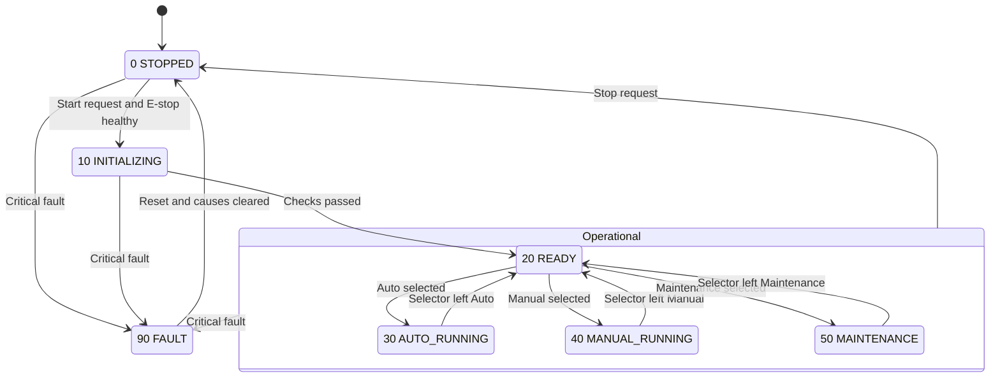
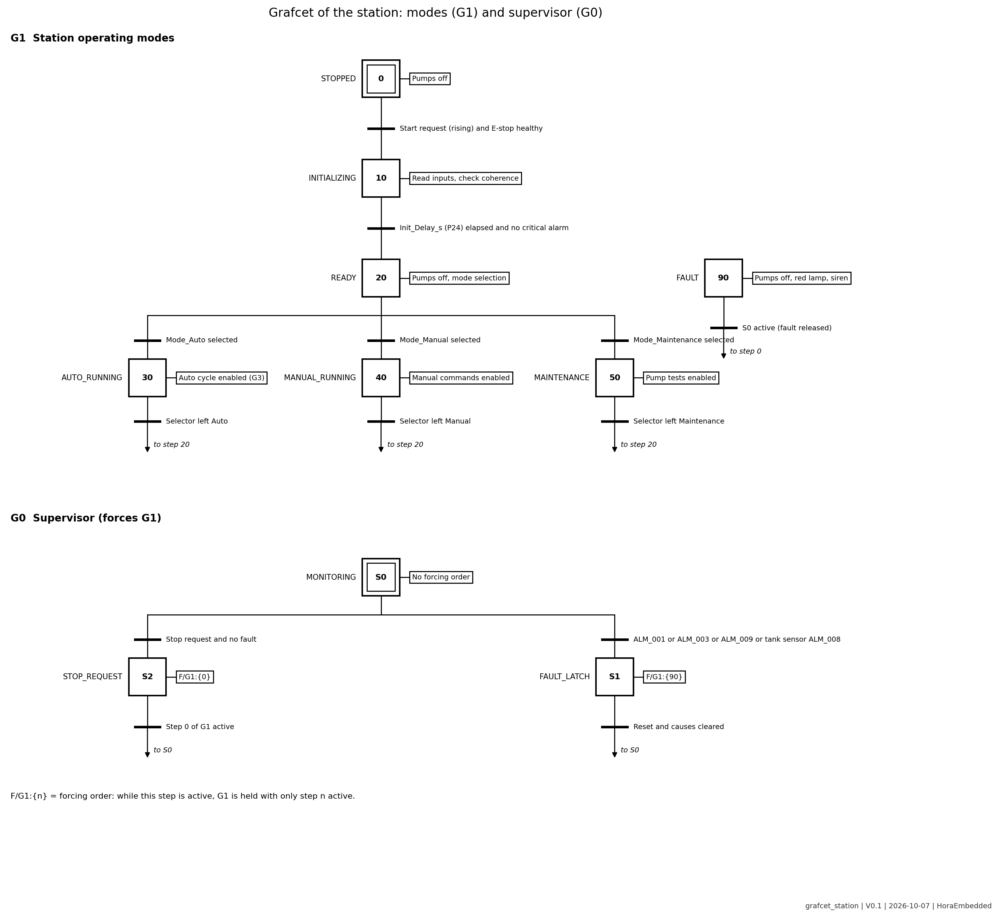
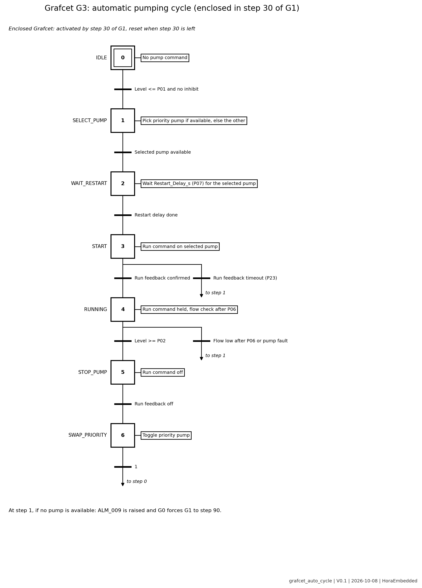

# Operating Modes and State Machine

## State diagram

Rendered natively by GitHub. Grafcet versions are in `diagrams/`.

## States

| Code | State | Purpose | Pumps | Lamps |
| --- | --- | --- | --- | --- |
| 0 | STOPPED | Known safe state | Off | All off |
| 10 | INITIALIZING | Read inputs, check coherence | Off | Green blinking |
| 20 | READY | Wait for mode selection | Off | Green steady |
| 30 | AUTO_RUNNING | Level control with alternation and backup | Automatic | Green steady |
| 40 | MANUAL_RUNNING | Operator commands each pump | On operator command | Green steady |
| 50 | MAINTENANCE | Controlled pump tests | On test command | Amber steady |
| 90 | FAULT | Protection state, waiting for correction and reset | Off | Red steady |

An active warning turns the amber lamp on in any state. The audible alarm sounds on a critical alarm until acknowledged.

## Transitions

| ID | From | To | Condition |
| --- | --- | --- | --- |
| TR01 | 0 | 10 | DI_Start_System rising edge and DI_EStop_Sim = TRUE |
| TR02 | 10 | 20 | Init_Delay_s (P24) elapsed, inputs coherent, no critical alarm |
| TR03 | 20 | 30 | Only DI_Mode_Auto selected |
| TR04 | 20 | 40 | Only DI_Mode_Manual selected |
| TR05 | 20 | 50 | Only DI_Mode_Maintenance selected |
| TR06 | 30 | 20 | Selector no longer on Auto |
| TR07 | 40 | 20 | Selector no longer on Manual |
| TR08 | 50 | 20 | Selector no longer on Maintenance |
| TR09 | 20, 30, 40, 50 | 0 | DI_Stop_System (normal stop, no fault) |
| TR10 | 0, 10, 20, 30, 40, 50 | 90 | ALM_001, ALM_003, ALM_009 or tank level sensor ALM_008 |
| TR11 | 90 | 0 | DI_Reset_Alarm and all critical causes cleared |

An invalid selector (none or several modes selected) counts as "not selected": the station stays in or returns to READY.

## Automatic cycle

G3 is enclosed in step 30. Leaving step 30 resets G3 to step 0 and switches the run commands off.

## Allowed actions per state

| Action | 0 | 10 | 20 | 30 | 40 | 50 | 90 |
| --- | --- | --- | --- | --- | --- | --- | --- |
| Automatic pumping | No | No | No | Yes | No | No | No |
| Manual pump command | No | No | No | No | Yes | No | No |
| Pump test | No | No | No | No | No | Yes, max Maint_Test_Max_s (P25) | No |
| Alarm acknowledgment | Yes | Yes | Yes | Yes | Yes | Yes | Yes |
| Fault reset | No | No | No | No | No | No | Yes |
| Parameter edit | Yes | No | Yes | No | No | Yes | No |

## Critical interlocks (active in every state and every mode)

| ID | Interlock | Effect | Alarm | Requirement |
| --- | --- | --- | --- | --- |
| IL-01 | DI_EStop_Sim = FALSE | All pump commands off, FAULT latched | ALM_001 | REQ-011 |
| IL-02 | DI_Source_Low or source level below Source_Min (P04) | Run commands off, starts inhibited until source above P04 + Source_Hyst_pct (P26) | ALM_002 | REQ-010 |
| IL-03 | Tank level above Level_CritHigh (P03) | All pumps off, FAULT latched | ALM_003 | REQ-012 |
| IL-04 | Pump fault input FALSE, or no run feedback within Run_Feedback_Timeout_s (P23) | That pump off and unavailable | ALM_006, ALM_007 | REQ-008, REQ-037 |
| IL-05 | Low flow after Flow_Validation_s (P06) | That pump off and unavailable | ALM_004, ALM_005 | REQ-016 |
| IL-06 | Another pump already running | Second run command refused | none | REQ-005 |
| IL-07 | Restart_Delay_s (P07) not elapsed since last stop | Start refused until elapsed | none | REQ-009 |
| IL-08 | Pumping demand and no pump available | FAULT latched | ALM_009 | REQ-015 |

## Fault recovery

- Critical faults (IL-01, IL-03, IL-08, tank level sensor) latch the station in FAULT.
- A reset is accepted only when all causes are cleared. Otherwise the fault is maintained.
- After a valid reset the station goes to STOPPED. The operator must request a start again, and the station passes through INITIALIZING. There is no automatic restart.
- A pump made unavailable by IL-04 or IL-05 stays unavailable until its cause is cleared and a reset is given. The station keeps running on the other pump.
- Sensors: tank level inconsistent is critical. Source level inconsistent is treated as source low (IL-02). Flow, pressure and current inconsistent raise a warning only.

## Definitions

- **Pump available**: no latched fault, no latched low flow.
- **Normal cycle**: start on a demand at Level_Low (P01), stop at Level_High (P02), with no fault and no low flow. The priority pump toggles only after a normal cycle (REQ-006).
- **Manual mode** is not limited by P02 but is stopped by IL-03 at P03.