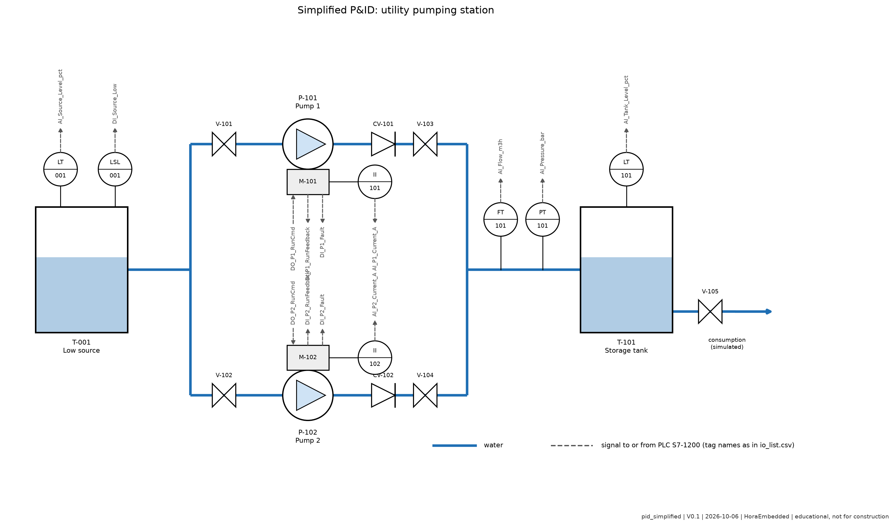

# P&ID Notes

Simplified P&ID following ISA 5.1 tag conventions. Educational, not for construction. Generated by `tools/fig_pid.py`.

## Tag convention

`<function letters>-<zone digit><sequence>`. Example: LT-101 is level transmitter 01 in the station zone (1xx). Zone 0xx is the source.

## Equipment list

| Tag | Description |
| --- | --- |
| T-001 | Low source tank |
| T-101 | Storage tank |
| P-101, P-102 | Centrifugal pumps, duty and standby |
| M-101, M-102 | Pump motors |
| V-101, V-102 | Manual suction isolation valves |
| V-103, V-104 | Manual discharge isolation valves |
| CV-101, CV-102 | Check valves, prevent backflow to a stopped pump |
| V-105 | Consumption valve (simulated drain) |

## Instrument list

| Tag | Measurement | Type | PLC tag |
| --- | --- | --- | --- |
| LSL-001 | Source low level | Digital | DI_Source_Low |
| LT-001 | Source level | Analog | AI_Source_Level_pct |
| LT-101 | Tank level | Analog | AI_Tank_Level_pct |
| FT-101 | Discharge flow | Analog | AI_Flow_m3h |
| PT-101 | Discharge pressure | Analog | AI_Pressure_bar |
| II-101, II-102 | Motor current | Analog | AI_P1_Current_A, AI_P2_Current_A |