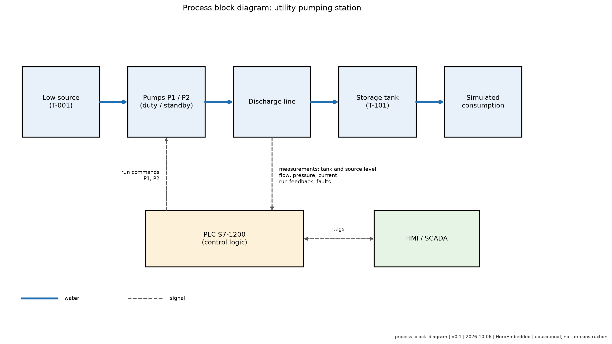

# Process Description

## Overview

Water flows from a low source through one of two pumps (duty or standby), along a discharge line, into a storage tank. A simulated consumption drains the tank. The PLC reads levels, flow and pump feedback, and decides which pump runs. Only one pump runs at a time in the base version.

## Control loop

| Element | Role |
| --- | --- |
| Controlled variable | Tank level (percent) |
| Setpoints | Start at 30 percent, stop at 80 percent (hysteresis) |
| Actuators | Pump P-101, pump P-102 (run command) |
| Sensors | Tank level, source level, flow, pressure, motor current, run feedback |
| Disturbances | Water consumption, leak, injected pump fault, blocked line |

## Why hysteresis

A single threshold would make a pump start and stop repeatedly around the setpoint. Two thresholds create a dead band that limits the number of starts and protects the motor.

## Diagram

