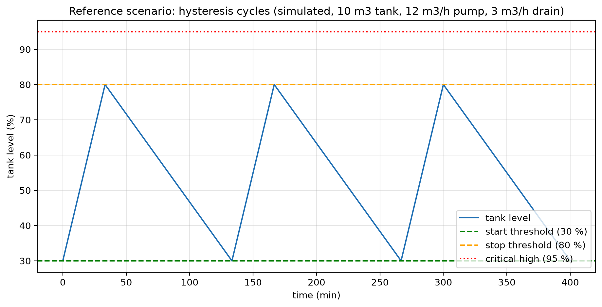

## Results (reference scenario)

| Quantity | Value |
| --- | --- |
| Rise rate, one pump running | 0.025 %/s (1.5 %/min) |
| Fall rate, no pump | 0.0083 %/s (0.5 %/min) |
| Fill time 30 to 80 percent | about 33 min |
| Drain time 80 to 30 percent | about 100 min |
| Cycle duration | about 133 min |
| Reference start rate | about 0.45 starts per hour |
| Pump duty | about 25 percent of the time |

## Interpretation

The tank refills three times faster than it drains. The pump therefore runs about one quarter of the time. The reference start rate is the baseline used later by rule ANO_04 (too frequent starts). Figure generated by `tools/fig_volume_balance.py`.